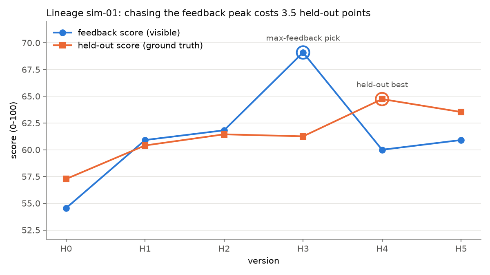
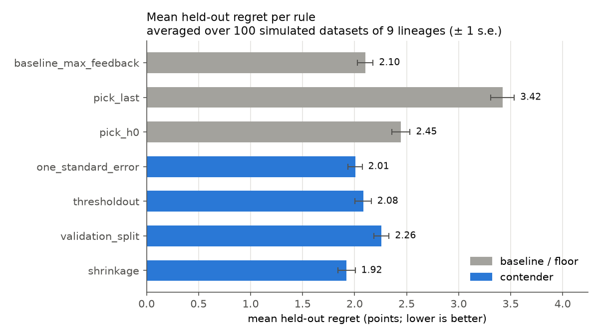

# Holdfast

**Reliable version selection for self-evolving agent harnesses.**

Holdfast compares rules for choosing the *final* version of a self-evolving
agent harness and scores each rule by **held-out regret**. It runs on simulated
data today. Real lineages can be dropped in later without changing any selection,
metric or evaluation code.

The full spec is in [`playbook/architecture.md`](playbook/architecture.md).

---

## The problem

The HarnessDev paper (*Can LLMs Create and Evolve Their Own Agent Harness?*,
arXiv:2609.01437) has a model revise a working harness `H0` into `H1 … Hn`,
guided by scores on a **feedback set**. At the end the model declares the
version with the best feedback score as final. Afterwards every version is also
scored on a **held-out set** that the model never saw. The paper reports:

* the declared version was the held-out best in only **2 of 9** lineages;
* feedback and held-out scores moved in the same direction only **~53%** of the time;
* re-running one frozen version moves its feedback score by **~±4.75 points**.

The model is maximizing a noisy validation signal that it reuses on every
revision, so it tends to ship a lucky spike. This is the winner's-curse /
adaptive-overfitting problem from model selection. Holdfast measures how much
better-founded selection rules help.

**Held-out regret** for one lineage is
`heldout[oracle_best] − heldout[chosen]`. It is 0 when the rule picks the truly
best version, and lower is better.

## The selection rules (`rules/selection.py`)

Every rule is a plain function `rule(feedback_scores, features, **options) -> index`.
Rules never receive `heldout_score`. Ties always go to the earliest version.

| Rule | What it does |
|---|---|
| `baseline_max_feedback` | The paper's rule: highest feedback score. **The one to beat.** |
| `pick_last` | Always ship `Hn`. Sanity floor. |
| `pick_h0` | Always ship `H0` (no evolution at all). Sanity floor. |
| `one_standard_error` | Takes the earliest version whose score is within one noise SE (4.75) of the best. Versions that are statistically tied with the leader get the earlier, less-edited version. |
| `thresholdout` | Steps through H0…Hn with an incumbent and switches only when a challenger beats it by more than `threshold × 4.75`. This ignores spikes inside the noise band. Knob `threshold` is tuned leave-one-lineage-out. |
| `validation_split` | Takes the best version on feedback tasks that were **withheld from the evolving model**. That signal is honest but noisier. It needs per-task data and reports `n/a` when a dataset has none. |
| `shrinkage` | Empirical-Bayes posterior mean of each version's quality, shrunk toward the lineage mean by an amount set by the noise, followed by argmax. Its prior lets neighboring versions share information (correlation `ρ^|i−j|`). Plain James-Stein (`ρ = 0`) rescales every score by the same factor and so never changes the argmax. Pooling with neighbors is what actually flattens an isolated spike. Knob `ρ` is tuned leave-one-lineage-out. |

To add a rule, write one function and decorate it with `@register_rule(...)`.
If the rule has a knob, give its name and grid in the decorator and `evaluate.py`
will tune it leave-one-lineage-out automatically.

## How to run

```bash
pip install -r requirements.txt && python run.py
```

The run takes about 10 seconds and has no network calls or API keys. It:

1. simulates 9 lineages (seed 7) and prints how closely they match the paper's statistics;
2. prints the results table for those 9 lineages: rule, mean regret, win rate vs
   baseline, loss rate vs baseline, how often the rule picked the held-out best,
   and the LOLO-tuned knob values;
3. repeats the evaluation on 100 independent simulated 9-lineage datasets and
   prints averages plus a **paired** regret difference vs the baseline (± s.e.);
4. writes `figures/trajectory.png` (feedback vs held-out for one lineage where the
   baseline misses the held-out best) and `figures/regret.png` (mean regret per rule).

Options: `--seed N`, `--replicates N` (`1` = only the 9-lineage run),
`--overfit-cost X` (simulator sensitivity, see caveats), `--source sim|real`,
`--data-path FILE`.

Tests (standard library `unittest`, no extra dependencies):

```bash
python -m unittest discover -s tests -t .
```

The tests cover: rules never read `heldout_score` (it is placed behind a
tripwire, and rewriting a test lineage's held-out scores never changes its LOLO
choice); regret is 0 for the oracle pick; the simulator output matches the data
contract; a fixed seed gives identical data and results; the simulator
reproduces the paper's statistics; and the loader round-trips CSV and JSON.

## Project layout

```
data/contract.py    Version / Lineage dataclasses + validator (the fixed data contract)
data/simulator.py   9 seed-controlled lineages calibrated to the paper
data/loader.py      real-data loader (CSV / JSON), documented schema
rules/selection.py  the selection rules + registry
metrics.py          held_out_regret, win_rate, dataset statistics (the only reader of heldout_score)
evaluate.py         runs every rule; leave-one-lineage-out tuning for rules with knobs
run.py              entrypoint: tables + figures
tests/              unit tests
```

### The data contract

`list[Lineage]`. Each `Lineage` has `lineage_id` and `versions` (H0…Hn). Each
`Version` has `feedback_score: float`, `heldout_score: float` and `features` =
`{edit_files: int, edit_lines: int, touched_verification: bool, revision_calls: int}`.
Two optional fields, `Version.task_feedback` (per-task feedback results) and
`Lineage.selection_tasks` (indices of withheld tasks), enable `validation_split`.
If they are `None`, that rule reports `n/a` and every other rule runs normally.

## Results on simulated data

These are the numbers from `python run.py` on the pinned environment.

Averaged over 100 simulated 9-lineage datasets (regret in held-out points):

| rule | mean regret | vs baseline (paired) | win rate | loss rate |
|---|---:|---:|---:|---:|
| baseline_max_feedback | 2.10 | — | — | — |
| pick_last | 3.42 | +1.32 ± 0.10 | 24% | 56% |
| pick_h0 | 2.45 | +0.34 ± 0.12 | 42% | 48% |
| one_standard_error | 2.01 | −0.10 ± 0.08 | 28% | 28% |
| thresholdout | 2.08 | −0.02 ± 0.08 | 20% | 22% |
| validation_split | 2.26 | +0.16 ± 0.08 | 30% | 35% |
| **shrinkage** | **1.92** | **−0.18 ± 0.06** | 14% | 10% |

For the single default dataset (seed 7, 9 lineages), the baseline has the
lowest regret (1.46), with `thresholdout` (1.48) and `one_standard_error` (1.49)
essentially tied. With only 9 lineages, one dataset cannot separate rules whose
true differences are a few tenths of a point. That is why the replicate average
is printed as well.




## Honest caveats

**The simulated results are illustrative until real lineages are loaded.** The
numbers above describe a simulator, not the authors' system.

* **Calibration.** The simulator was tuned to match the paper's statistics
  (averaged over 100 seeds: 53% direction agreement, 2.2 of 9 max-feedback hits,
  feedback noise ≈ 4.75). It was **not** tuned to make any rule win. Matching
  three summary numbers still leaves many unknowns.
* **One assumption decides the ranking.** In the simulator, overfitting the
  feedback set can also cost real quality (`overfit_quality_cost`, default 0.5).
  The paper's story, where a lucky spike does worse on the tasks that matter,
  implies this cost is non-zero, but its size is unknown. Paired regret vs the
  baseline over 100 datasets (negative is better; reproduce with
  `python run.py --overfit-cost X`):

  | `overfit_quality_cost` | one_standard_error | thresholdout | validation_split | shrinkage |
  |---:|---:|---:|---:|---:|
  | 0.0 | +0.52 ± 0.07 | +0.25 ± 0.06 | +0.67 ± 0.09 | −0.09 ± 0.04 |
  | 0.5 (default) | −0.10 ± 0.08 | −0.02 ± 0.08 | +0.16 ± 0.08 | −0.18 ± 0.06 |
  | 1.0 | −0.79 ± 0.09 | −0.87 ± 0.11 | −0.17 ± 0.10 | −0.13 ± 0.06 |

  Neighbor-pooling `shrinkage` is the only rule that beats the baseline in every
  setting. `one_standard_error` and `thresholdout` help only when chasing
  feedback really hurts held-out quality. At the default setting their gain is
  within noise.
* **Differences from the expectations in architecture.md §9.** The spec
  predicted that `one_standard_error` and `thresholdout` would clearly reduce
  regret and that `validation_split` would be strongest. On this simulator that
  holds only under stronger overfitting. `validation_split` suffers because it
  selects on only the 33 withheld tasks (noise ≈ 8.7 points vs 4.75). It is
  likely to do better with a larger withheld set or real per-task data. These
  results are reported as they came out and were not tuned toward the
  hypotheses.
* **Small sample.** With 9 lineages, win rates move in steps of 11%, and a single
  dataset rarely separates the rules. Treat the real-data results the same way.

## How to plug in real data

Only [`data/loader.py`](data/loader.py) is involved. Its docstring has the full schema.

1. Write one row per version to `data/real/lineages.csv`:
   `lineage_id, version_index, feedback_score, heldout_score, edit_files, edit_lines, touched_verification, revision_calls`.
   You can instead use the JSON layout that `save_lineages_json` writes.
2. *(Optional, enables `validation_split`.)* Add `data/real/lineages_tasks.csv` with
   `lineage_id, version_index, task_id, score, is_selection_task`, one row per
   version per feedback task. Mark the tasks that were withheld from the
   evolving model.
3. Run `python run.py --source real`, or add `--data-path path/to/file.csv|.json`.

The loader checks every lineage against the contract before any rule runs.
Until the file exists, `--source real` prints these instructions and exits.
Real data is git-ignored under `data/real/` by default.

## Constraints

Python 3.11+, `numpy`, `pandas` and `matplotlib` only, with versions pinned in
`requirements.txt`. There are no LLM APIs, paid services or API keys. All
randomness goes through seeded `numpy.random.Generator`s, so every number above
is exactly reproducible.
